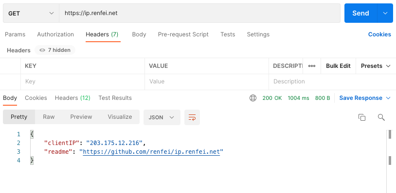
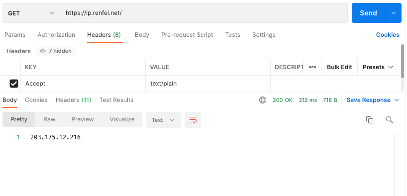
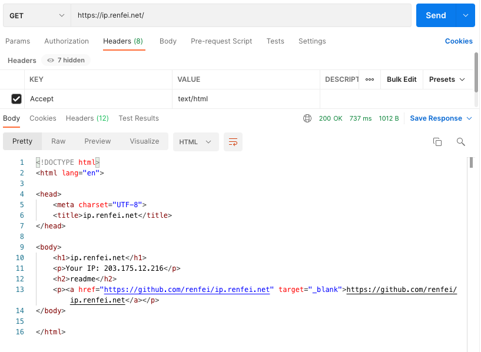

# ip.renfei.net

获取你的公网 IP 地址：

* [ip.renfei.net](https://ip.renfei.net)：IPv6/IPv4 混合（IPv6 优先）
* [ipv4.renfei.net](https://ipv4.renfei.net)：只获取 IPv4（无 IPv4 网络将无法访问）
* [ipv6.renfei.net](https://ipv6.renfei.net)：只获取 IPv6（无 IPv6 网络将无法访问）

## 使用场景

举个栗子，你可以在这些场景中使用到它：

<details>
<summary>点此展开查看示例</summary>

### 让用户访问获得 IP

在工作生产环境中，我经常遇到需要给远程办公的同事开通防火墙白名单，这个时候就需要知道他的公网IP。

那么我就让他访问一下 [ip.renfei.net](https://ip.renfei.net) 把他的IP告诉我，如果只想要 IPv4 的地址，那么就访问 [ipv4.renfei.net](https://ipv4.renfei.net)

这样就可以给他设置白名单了，通过防火墙访问内部资产。

### DDNS动态域名解析

我在外面需要访问家里的设备，那么就需要知道家里的 IP 地址，但家庭宽带的 IP 地址是动态的，就需要 DDNS 动态域名解析。

这个时候我就在家里的设备上写一个脚本，定时访问 [ip.renfei.net](https://ip.renfei.net) 获得公网IP，然后调用域名解析的 API 接口进行修改域名解析记录。

### 在服务器上获取服务器的公网出口 IP

在机房环境中，网络可能有多层 NAT，不知道出口的 IP 地址，想知道自己的出口 IP，就可以在服务器上执行：

```bash
curl ip.renfei.net
```

</details>

## 请求头说明

你可以通过控制请求头中的```Accept``` 字段来控制响应返回格式：

<details>
<summary>点此展开查看示例</summary>

### 默认返回 JSON 格式

当你不声明 ```Accept``` 请求头时，或者声明了不支持的```Accept``` 请求头时，默认以 JSON 格式返回，例如如下情况你会得到下面的响应结果：



### 返回 XML 格式

当你的程序需要 XML 格式的响应时，你可以声明 ```Accept```请求头为：```xml```、```text/xml```、```application/xml```，你将得到下面的响应结果：


### 返回 TEXT 文本格式

当你的程序需要 TEXT 纯文本格式时，你可以声明 ```Accept```请求头为：```text```、```text/plain```，你将得到下面的响应结果：



### 返回 HTML 网页格式

当你请求头```Accept```为：```text/html```、```application/xhtml+xml```，你将得到下面的响应结果：


</details>

## IP 地址在变化

有一种情况，你获取的 IP 地址总在变化，这种情况是因为：

* 宽带二级运营商：鹏博士宽带、长城宽带、广电宽带(有线宽带)、艾普宽带、金桥网等租用一级运营商的带宽二次销售，就会出现多个互联网出口，每次 IP 地址都不一样
* 企业单位的网络：部分企业单位网络出口具有负载均衡策略，多条网络带宽接入进行融合，所以出现出口 IP 变化的情况

### 如何解决？

IP 地址不固定是用户所处的网络环境导致的，我们一般无法主动干预，只能推荐用户去咨询网管、运营商，是否能给配置固定 IP。

## 其他需求

此接口已经允许跨域请求，也就是说你可以在你的页面上调用，获取用户的公网 IP。

如果你还需要其他需求，可以提交 Issue 给我。