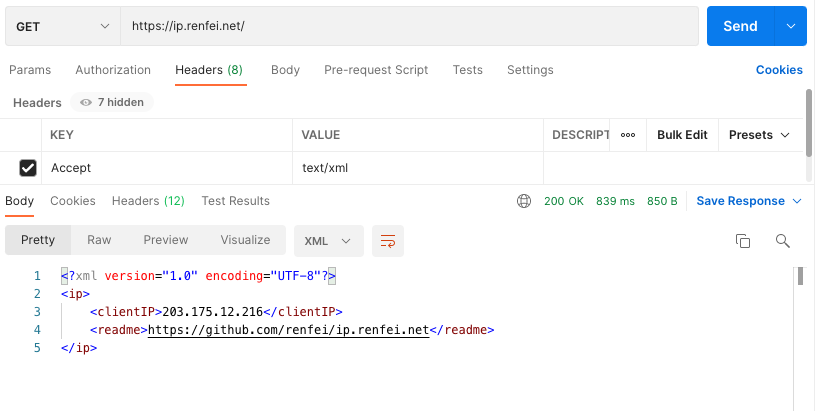

# ip.renfei.net

获取你的公网 IP 地址：

* [ip.renfei.net](https://ip.renfei.net)：IPv6/IPv4 混合（IPv6 优先）
* [ipv4.renfei.net](https://ipv4.renfei.net)：只获取 IPv4（无 IPv4 网络将无法访问）
* [ipv6.renfei.net](https://ipv6.renfei.net)：只获取 IPv6（无 IPv6 网络将无法访问）

## 请求头说明

你可以通过控制请求头中的```Accept``` 字段来控制响应返回格式。

### 默认返回 JSON 格式

当你不声明 ```Accept``` 请求头时，或者声明了不支持的```Accept``` 请求头时，默认以 JSON 格式返回，例如如下情况你会得到下面的响应结果：


### 返回 XML 格式

当你的程序需要 XML 格式的响应时，你可以声明 ```Accept```请求头为：```xml```、```text/xml```、```application/xml```，你将得到下面的响应结果：



### 返回 TEXT 文本格式

当你的程序需要 TEXT 纯文本格式时，你可以声明 ```Accept```请求头为：```text```、```text/plain```，你将得到下面的响应结果：


### 返回 HTML 网页格式

当你请求头```Accept```为：```text/html```、```application/xhtml+xml```，你将得到下面的响应结果：


## 其他需求

此接口已经允许跨域请求，也就是说你可以在你的页面上调用，获取用户的公网 IP。

如果你还需要其他需求，可以提交 Issue 给我。